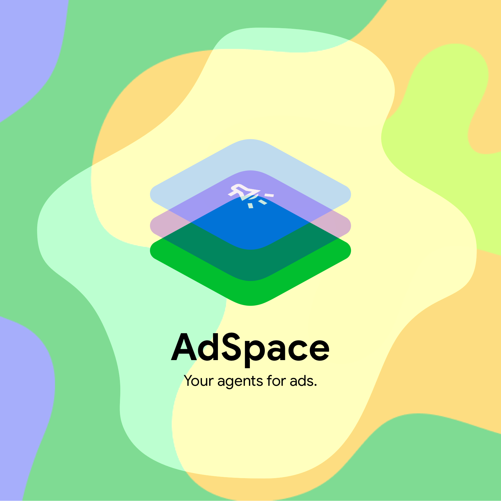

**This is not an officially supported Google product.**



# AdSpace Agent

AdSpace Agent is designed to provide a standardized way to integrate an LLM with
Google Ads, YouTube, Google Cloud, and Google Search to form a more
comprehensive campaign and marketing plan for agencies.

[](https://github.com/google-marketing-solutions/adspace_agent/actions/workflows/ci.yml)
[](https://google.github.io/styleguide/pyguide.html)
[](https://conventionalcommits.org)
[](https://github.com/pre-commit/pre-commit)

## Setup

### Environment Variables

Create a `.env` file in the root of the project. Here are the environment
variables required for the project:

```shell
# ADK
export GOOGLE_CLOUD_LOCATION=global
export GOOGLE_CLOUD_PROJECT=
export GOOGLE_GENAI_USE_VERTEXAI=TRUE

# Google API Toolsets
export CLIENT_ID=
export CLIENT_SECRET=

# Required for: `adspace_agent/tools/google_ads.py`
# Reference:
# https://developers.google.com/google-ads/api/docs/client-libs/python/configuration#env-config-fields
# https://github.com/googleads/google-ads-python/blob/HEAD/google-ads.yaml
# https://developers.google.com/google-ads/api/docs/api-policy/developer-token
export GOOGLE_ADS_CLIENT_ID=
export GOOGLE_ADS_CLIENT_SECRET=
export GOOGLE_ADS_DEVELOPER_TOKEN=
export GOOGLE_ADS_LOGIN_CUSTOMER_ID=
export GOOGLE_ADS_REFRESH_TOKEN=
export GOOGLE_ADS_USE_PROTO_PLUS="True"
```

When deploying, you can set those environment variables in the Google Cloud user
interface.

For Google Ads integration, you will need to create a refresh token. You can
generate a refresh token by running:

```shell
./generate_refresh_token.sh
```

Or, do it manually. First, create an Oauth client to set up the consent screen.
Ensure that you have added `http://localhost` as a redirect URI. Now, visit:

```text
https://accounts.google.com/o/oauth2/auth?client_id=<YOUR_CLIENT_ID>&redirect_uri=http://localhost&scope=https://www.googleapis.com/auth/adwords&response_type=code&access_type=offline
```

Copy the code from the URL parameter in the blank redirected page and paste it
as the `code` parameter here:

```shell
curl --request POST \
  --data "code=<YOUR_AUTHORIZATION_CODE>" \
  --data "client_id=<YOUR_CLIENT_ID>" \
  --data "client_secret=<YOUR_CLIENT_SECRET>" \
  --data "redirect_uri=http://localhost" \
  --data "grant_type=authorization_code" \
  https://oauth2.googleapis.com/token
```

Use `curl` to grab the refresh token. Copy and paste the `refresh_token` from
the response to your new `.env` file. You're now all set!

### Running Locally

Install the dependencies with `uv` including all development dependencies:

```shell
uv sync --all-extras
```

Run the ADK webserver locally:

```shell
uv run adk web
```

Follow the URL to open the web interface.

### GoogleApiToolkit

The APIs and Versions that can be used with this class can be found running the
below:

```
from googleapiclient import discovery

service = discovery.build('discovery', 'v1')

request = service.apis().list()
response = request.execute()

for api in response.get('items', []):
  print(api.get('name'), api.get('version'))
```

## Deployment

To deploy the application, you can use the Google Cloud user interface to set
the environment variables. Refer to the previous section for instructions on how
to set up the environment variables.

```shell
gcloud run deploy adspace-agent \
  --source . \
  --memory 4Gi
```

You will also need the following APIs enabled:

```shell
gcloud services enable \
  aiplatform.googleapis.com \
  bigquery.googleapis.com \
  cloudbuild.googleapis.com \
  dfareporting.googleapis.com \
  displayvideo.googleapis.com \
  doubleclickbidmanager.googleapis.com \
  drive.googleapis.com \
  googleads.googleapis.com \
  run.googleapis.com \
  merchantapi.googleapis.com \
  searchads360.googleapis.com \
  storage.googleapis.com \
  youtube.googleapis.com
```

## Contributing

Want to contribute? [Learn more](CONTRIBUTING.md)
